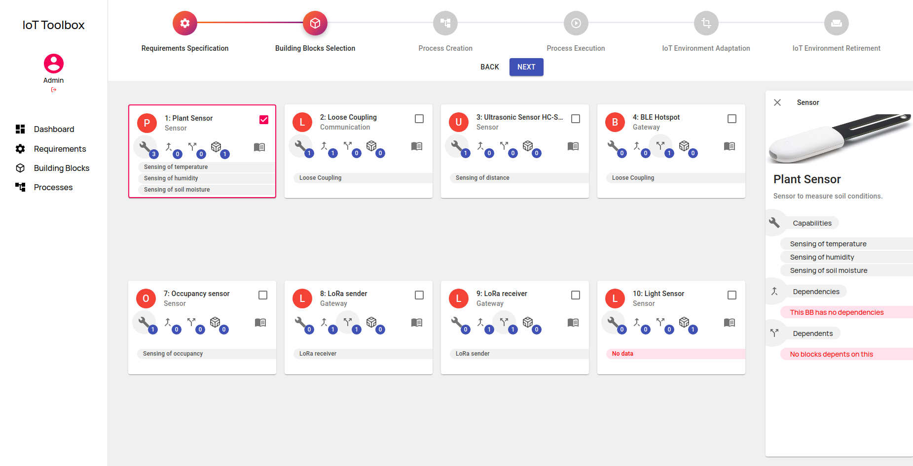

# IoT Toolbox - Easing the Setup of IoT Applications

This project contains the **IoT Toolbox** Prototype, an IoT platform developed for easing the setup of IoT environments and their applications.

This specific project deals with the Back-End side of the project. The Front-End documentation is provided as the GitHub project [IoT Toolbox Front-End](https://github.com/mtfrigo/IoT-Toolbox-Frontend).

# Presentation

The toolbox contains common building blocks that are oftentimes used in the creation of IoT environments. These building blocks can represent hardware components, network protocols, message brokers, gateways, IoT platforms, or any other software component. A building block consists of a high-level description to be understandable by domain experts as well as concrete implementations. The building blocks are provided by experts in building IoT environments and are included in a toolbox, which can be accessed by domain experts.

Furthermore, we introduce a business process based approach to set up the IoT environments based on the suggested building blocks. Hence, it makes sense to use business process management for orchestration of these steps. In this paper, we use the Business Process.

How to install and use the Toolbox is explained in the following.

## Installation (for developers)

The following software components are used in order to set up the toolbox: 
* Back-End: [NodeJS](https://nodejs.org/en/), [Docker](https://docs.docker.com/get-docker/) and NPM.
* Front-End: ReactJS.

### 1.1 Installation (on Linux)

### First run:

Create directory for the database volume
`sudo mkdir -p $HOME/docker/volumes/postgres`

Create docker container
`sudo docker run --rm --name pg-docker -e POSTGRES_PASSWORD=docker -d -p 5432:5432 -v $HOME/docker/volumes/postgres:/var/lib/postgresql/data postgres:11.5`

Create database: `sudo docker exec -it <DOCKER_CONTAINER_ID> psql -U postgres -d postgres -c "CREATE DATABASE iot_db;"`

Run the migrations: `npx sequelize db:migrate`

Run the seeds: `npx sequelize db:seed:all`

Go to the root folder after cloning this repository and use the command: `npm install`.

### Running the application:

After all libraries been installed and the docker container created you can start the node server by using the command: `npm start`. The default server port is 3032. 

To setup the front-end go to installation section on the [IoT Toolbox Front-End](https://github.com/mtfrigo/IoT-Toolbox-Frontend) project.

## REST API

A REST API is implemented using nodejs. 

For the API complete reference click [here](https://github.com/mtfrigo/IoT-Toolbox-Backend/wiki/API-Reference)

## Running instance

A running instance of the prototype can be accessed [here](https://github.com/mtfrigo/IoT-Toolbox-Backend) [OFFLINE]
